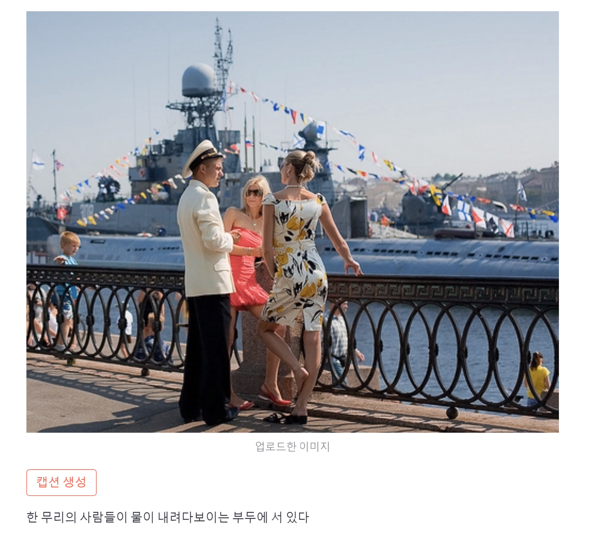

# image-to-text
> image to text 모델을 직접 만들어보고 AI 모델의 작동 원리와 데이터 처리 과정을 이해한다

# 소개

**1개의** 데이터 세트(Flick8k) 사용하여 훈련
* image를 입력 받아 text 형태로 출력하는 모델 기능을 구현
* 훈련 데이터셋(Flick8k) 3만개의 이미지와 이미지마다 5개의 캡션
**tip** : 사람이나 풍경위주의 이미지로 구성되어 있다

**streamlit** 으로 실행 결과

 

# 모델 구성

